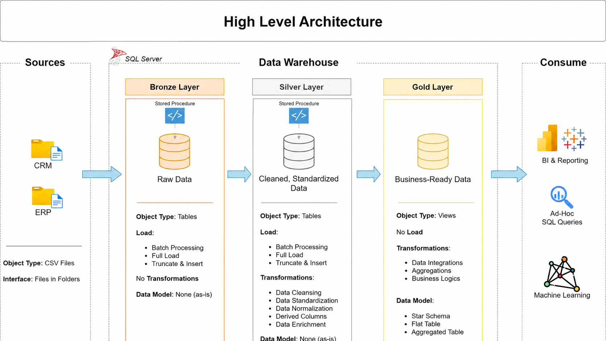

# Data Warehouse and Analytics Project

Welcome to the **Data Warehouse and Analytics Project** repository! 🚀  
This project demonstrates a comprehensive data warehousing and analytics solution, from building a data warehouse to generating actionable insights. Designed as a portfolio project, it highlights industry best practices in data engineering and analytics.


## 🔗 Two-Part SQL Portfolio Project

This end-to-end SQL project is divided into two connected repositories, covering the complete journey from raw data ingestion to business analysis and reporting.

Part 1: SQL Data Warehouse

The first part focuses on building a modern data warehouse using the Medallion Architecture.

It includes:

* Loading raw CRM and ERP data into the Bronze Layer
* Cleaning and standardizing data in the Silver Layer
* Integrating multiple source systems
* Building fact and dimension tables in the Gold Layer
* Creating a business-ready star schema for analytics

➡️ Explore the SQL Data Warehouse Project - https://github.com/Sumerazam916/sql-datawarehouse-project

Part 2: SQL Data Analysis

The second part uses the Gold Layer tables created in Project 1 to perform SQL-based business analysis.

It includes:

* Database and dimension exploration
* Data quality and relationship checks
* Sales, customer and product KPIs
* Sales trend analysis
* Cumulative and year-over-year analysis
* Product performance analysis
* Customer segmentation
* Part-to-whole analysis
* Customer and product reporting views

➡️ Explore the SQL Data Analysis Project - https://github.com/Sumerazam916/sql-data-analysis-project


## 🔄 End-to-End Project Workflow

          CRM and ERP CSV Files
                    ↓
          Project 1: SQL Data Warehouse
                    ↓
          Bronze Layer
          Raw data ingestion
                    ↓
          Silver Layer
          Data cleaning and transformation
                    ↓
          Gold Layer
          Fact and dimension tables
                    ↓
          Project 2: SQL Data Analysis
                    ↓
          Exploration, KPIs, trends, segmentation and reports
          


---
## 🏗️ Data Architecture

The data architecture for this project follows Medallion Architecture **Bronze**, **Silver**, and **Gold** layers:


1. **Bronze Layer**: Stores raw data as-is from the source systems. Data is ingested from CSV Files into SQL Server Database.
2. **Silver Layer**: This layer includes data cleansing, standardization, and normalization processes to prepare data for analysis.
3. **Gold Layer**: Houses business-ready data modeled into a star schema required for reporting and analytics.

---
## 📖 Project Overview

This project involves:

1. **Data Architecture**: Designing a Modern Data Warehouse Using Medallion Architecture **Bronze**, **Silver**, and **Gold** layers.
2. **ETL Pipelines**: Extracting, transforming, and loading data from source systems into the warehouse.
3. **Data Modeling**: Developing fact and dimension tables optimized for analytical queries.
4. **Analytics & Reporting**: Creating SQL-based reports and dashboards for actionable insights.

🎯 This repository is an excellent resource for professionals and students looking to showcase expertise in:
- SQL Development
- Data Architect
- Data Engineering  
- ETL Pipeline Developer  
- Data Modeling  
- Data Analytics  

---

## 🛠️ Important Links & Tools:

Everything is for Free!
- **[Datasets](datasets/):** Access to the project dataset (csv files).
- **[SQL Server Express](https://www.microsoft.com/en-us/sql-server/sql-server-downloads):** Lightweight server for hosting your SQL database.
- **[SQL Server Management Studio (SSMS)](https://learn.microsoft.com/en-us/sql/ssms/download-sql-server-management-studio-ssms?view=sql-server-ver16):** GUI for managing and interacting with databases.
- **[Git Repository](https://github.com/):** Set up a GitHub account and repository to manage, version, and collaborate on your code efficiently.
- **[DrawIO](https://www.drawio.com/):** Design data architecture, models, flows, and diagrams.
- **[Notion](https://www.notion.com/templates/sql-data-warehouse-project):** Get the Project Template from Notion
- **[Notion Project Steps](https://thankful-pangolin-2ca.notion.site/SQL-Data-Warehouse-Project-16ed041640ef80489667cfe2f380b269?pvs=4):** Access to All Project Phases and Tasks.

---

## 🚀 Project Requirements

### Building the Data Warehouse (Data Engineering)

#### Objective
Develop a modern data warehouse using SQL Server to consolidate sales data, enabling analytical reporting and informed decision-making.

#### Specifications
- **Data Sources**: Import data from two source systems (ERP and CRM) provided as CSV files.
- **Data Quality**: Cleanse and resolve data quality issues prior to analysis.
- **Integration**: Combine both sources into a single, user-friendly data model designed for analytical queries.
- **Scope**: Focus on the latest dataset only; historization of data is not required.
- **Documentation**: Provide clear documentation of the data model to support both business stakeholders and analytics teams.

---

### BI: Analytics & Reporting (Data Analysis)

#### Objective
Develop SQL-based analytics to deliver detailed insights into:
- **Customer Behavior**
- **Product Performance**
- **Sales Trends**

These insights empower stakeholders with key business metrics, enabling strategic decision-making.  

## 📂 Repository Structure
```
data-warehouse-project/
│
├── datasets/                           # Raw datasets used for the project (ERP and CRM data)
│
├── docs/                               # Project documentation and architecture details
│   ├── data_architecture.drawio        # Draw.io file shows the project's architecture
│   ├── data_catalog.md                 # Catalog of datasets, including field descriptions and metadata
│   ├── data_flow_diagram.png                # Draw.io file for the data flow diagram
│   ├── data_models.png              # Draw.io file for data models (star schema)
|   ├── data_integration.png          # describes how data tables are integrated or related to each other
|   ├── data_layers.pdf               # gives an understanding about the different Medallion layers
│
├── scripts/                            # SQL scripts for ETL and transformations
│   ├── bronze/                         # Scripts for extracting and loading raw data
│   ├── silver/                         # Scripts for cleaning and transforming data
│   ├── gold/                           # Scripts for creating analytical models
│
├── tests/                              # Test scripts and quality files
│
├── README.md                           # Project overview and instructions
├── LICENSE                             # License information for the repository
```
---

## ✨ Key Project Highlights

* Designed a data warehouse using Bronze, Silver and Gold layers
* Developed SQL-based ETL pipelines for CRM and ERP source data
* Applied data cleaning, standardization and validation rules
* Integrated multiple source systems into a unified data model
* Created fact and dimension tables using star schema principles
* Performed exploratory and business-focused SQL analysis
* Used CTEs, joins, aggregate functions and window functions
* Analyzed customer behaviour, product performance and sales trends
* Created reusable customer and product reporting views
* Documented the architecture, data flow and data model

## 🎯 What This Project Achieves

This project transforms raw CRM and ERP data into a structured analytical solution that helps answer important business questions across sales, customers and products.

### Sales Performance

* How much revenue has the business generated?
* How many orders and products have been sold?
* How has sales performance changed over months and years?
* Which periods recorded the highest and lowest sales?
* Is revenue increasing or decreasing compared with previous periods?
* What is the cumulative sales performance over time?
* Customer Insights
* Who are the highest-value customers?
* Which customers place the most orders?
* How much does each customer spend on average?
* How recently has each customer made a purchase?
* How long has each customer been purchasing from the business?
* Which customers can be classified as VIP, Regular or New?
* Which countries and customer groups contribute the most revenue?
* Product Performance
* Which products generate the most and least revenue?
* Which products are purchased most frequently?
* How does each product perform compared with its historical average?
* How does product performance compare with the previous year?
* Which product categories contribute the largest share of total sales?
* How many unique customers purchase each product?
* Which products may require further business attention?
* Reporting and Decision Support

The project also creates reusable customer and product reporting views that provide business-ready metrics such as:

1. Total revenue
2. Total orders
3. Total quantity sold
4. Average order value
5. Customer and product lifespan
6. Purchase recency
7. Average monthly spending
8. Average monthly product revenue
9. Customer segmentation
10. Product performance classification

## 🚀 How to Run the Complete Project

1. Clone Both Repositories

          git clone https://github.com/Sumerazam916/sql-datawarehouse-project.git
          git clone https://github.com/Sumerazam916/sql-data-analysis-project.git

2. Install the Required Tools

          SQL Server 2022 or later
          SQL Server Management Studio
          Git

3. Open Project 1 in SSMS

Run the Project 1 SQL scripts in this order:

          1. init_database.sql
          2. Bronze Layer/ddl_script.sql
          3. Bronze Layer/load_procedure.sql
          4. tests/Bronze_quality_checks.sql
          5. Silver Layer/ddl_silver.sql
          6. Silver Layer/proc_load_silver.sql
          7. tests/Silver_quality_checks.sql
          8. Gold Layer/ddl_gold.sql

4. Update the Dataset Paths

Before running the Bronze load procedure, update the CSV file paths inside:

          Bronze Layer/load_procedure.sql

Use the location where the Project 1 datasets are saved on your computer.

5. Load the Data Warehouse

Run the Bronze and Silver stored procedures:

          EXEC Bronze.load_bronze;
          EXEC Silver.load_Silver;

This creates the final Gold Layer objects:

          Gold.dim_customers
          Gold.dim_products
          Gold.fact_sales
          
6. Open Project 2 in SSMS

Make sure the active database is:

          USE DataWarehouse;
          GO

Run the Project 2 analysis scripts in order:

          01. Database Exploration
          02. Dimensions Exploration
          03. Date and Time Exploration
          04. Measure Exploration
          05. Magnitude Analysis
          06. Ranking Analysis
          07. Change-Over-Time Analysis
          08. Cumulative Analysis
          09. Performance Analysis
          10. Part-to-Whole Analysis
          11. Data Segmentation
          12. Create the Final Reports
          
Run:

          Customer_Report.sql
          Products_Report.sql

8. View the Results
   
          SELECT * FROM Gold.dim_customers;
          SELECT * FROM Gold.dim_products;
          SELECT * FROM Gold.fact_sales;
          SELECT * FROM Gold.report_customer;
          SELECT * FROM Gold.report_products;
   
## Complete Workflow

          Clone Repositories
                  ↓
          Create SQL Database
                  ↓
          Load Bronze Layer
                  ↓
          Clean Data in Silver Layer
                  ↓
          Create Gold Star Schema
                  ↓
          Run SQL Analysis
                  ↓
          Create Customer and Product Reports
                  ↓
          View Results in SSMS

## 🛡️ License

This project is licensed under the [MIT License](LICENSE). You are free to use, modify, and share this project with proper attribution.

## 🌟 About Me

Hi there! I'm **Sumer Azam**, I’m a passionate Data Analyst looking to learn and grow. If you have any questions or advices regarding this project, feel free to contact me as i would to teach and be taught as well.

Let's stay in touch! Feel free to connect with me on the following platforms:

[](https://www.linkedin.com/in/sumer-azam916/)
[](https://x.com/Sumer_azam)
